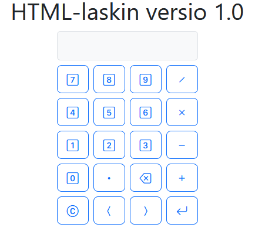

# HTML-laskin


## 📸 Esikatselu



## 🔗 Live Demo

👉 https://thermopylai.github.io/javascript-calculator

---

Yksinkertainen selainpohjainen nelilaskin, joka on toteutettu HTML:llä, JavaScriptillä ja Bootstrapilla. Sovellus tarjoaa selkeän käyttöliittymän peruslaskutoimituksiin ja toimii suoraan selaimessa ilman erillistä asennusta.

## 📖 Kuvaus

Tämä projekti on harjoitustyö, jossa on yhdistetty useita verkkokehityksen perustekniikoita samaan pieneen sovellukseen. Laskimessa on painikkeet numeroille, perusoperaattoreille, desimaalierottimelle, suluille sekä toiminnoille **clear**, **backspace** ja **calculate**. Käyttöliittymä hyödyntää Bootstrapin valmiita tyyliluokkia ja Bootstrap Icons -ikoneita, mikä tekee ulkoasusta siistin ja helposti luettavan.

## Ominaisuudet

- peruslaskutoimitukset: yhteenlasku, vähennyslasku, kertolasku ja jakolasku
- tuki desimaaliluvuille
- tuki sulkeille laskulausekkeissa
- viimeisimmän merkin poisto (backspace)
- koko syötteen tyhjennys (clear)
- lausekkeen laskenta omalla JavaScript-logiikalla
- selainpohjainen käyttö ilman palvelinta
- saavutettavuutta parantavia `aria-label`-määrittelyjä

## Käytetyt tekniikat

- **HTML5** rakenteeseen
- **JavaScript** laskentalogiikkaan ja tapahtumankäsittelyyn
- **Bootstrap 5** käyttöliittymän asetteluun ja painikkeiden tyylittelyyn
- **Bootstrap Icons** painikkeiden kuvakkeisiin

## Projektin rakenne

```text
.
├── index.html   # käyttöliittymä
└── index.js     # laskimen toiminnallisuus
```

## Käynnistys

1. Lataa tai kloonaa projekti omalle koneellesi.
2. Avaa `index.html` selaimessa.
3. Käytä laskinta painamalla näytöllä olevia painikkeita.

Erillistä asennusta tai pakettienhallintaa ei tarvita, koska Bootstrap ja ikonit ladataan CDN:n kautta.

## Miten projekti toimii

Käyttöliittymä on rakennettu keskitetystä näyttökentästä ja painikeriveistä. Painikkeille on määritelty `data-value`- ja `data-action`-attribuutteja, joiden avulla JavaScript tunnistaa, lisätäänkö merkki näytölle vai suoritaanko jokin toiminto, kuten tyhjennys, askelpalautus tai laskenta.

Laskenta ei perustu suoraan `eval()`-funktioon, vaan lauseke käsitellään vaiheittain JavaScriptissä. Syöte ensin siistitään, sitten pilkotaan osiin, minkä jälkeen se arvioidaan omalla parserilla. Tämä tekee toteutuksesta turvallisemman ja samalla opettavaisen harjoituksen lausekkeiden käsittelystä.

## Mitä projektissa on harjoiteltu

Tässä projektissa on harjoiteltu muun muassa:

- DOM-elementtien hakemista ja käsittelyä
- tapahtumankuuntelijoiden käyttöä
- `data-`attribuuttien hyödyntämistä
- funktioiden jakamista selkeisiin vastuisiin
- merkkijonojen käsittelyä ja syötteen validointia
- käyttöliittymän rakentamista Bootstrapin avulla
- saavutettavuuden perusteita

## Mahdollisia jatkokehitysideoita

- näppäimistötuki
- laskuhistorian lisääminen
- virheilmoitusten näyttäminen käyttäjäystävällisemmin
- tumma ja vaalea teema
- prosenttilasku ja muut lisätoiminnot
- responsiivisuuden hienosäätö pienille näytöille

## Yhteenveto

Tämä projekti on kompakti mutta hyvä esimerkki siitä, miten HTML, JavaScript ja Bootstrap voidaan yhdistää toimivaksi selainpohjaiseksi sovellukseksi. Vaikka kyseessä on yksinkertainen laskin, mukana on useita tärkeitä peruskäsitteitä, joista on hyötyä myös suuremmissa web-projekteissa.

## Tekijä

**Lauri Tikkanen**

GitHub: [Thermopylai](https://github.com/Thermopylai)